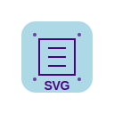
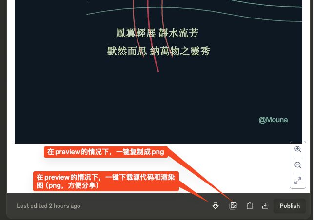

  
  <h1>Claude Enhancer</h1>
  <blockquote>Your Helpful Artifact Enhancer. </blockquote>

## Usage

1. **download**: visit [Releases Page](https://github.com/cs-magic/exts_chrome_claude-enhancer/releases) and download the latest / stable zip file
2. **install**: visit Chrome Extensions Page (chrome://extensions), enable the development mode, and load the unpacked extension
3. **run**: visit https://claude.ai
4. **use**:

    

## Motivation

[Claude Artifact](https://support.anthropic.com/en/articles/9487310-what-are-artifacts-and-how-do-i-use-them) is pretty useful, but with one fatal shortage when it comes downloading the svg into png/jpg for sharing on social media like WeChat.

I used to download the SVG via the built-in action button, and upload onto third-party website like https://cloudconvert.com/svg-to-png which is limited and inconvenient.

So I spent a whole day developing this tiny extension in order to save your day.

Enjoy it!

## Release

### v0.1.0_beta.0_2024-09-19

- [x] feat: poe supports artifact (SVG-Copilot can do this)
- [x] feat: download with svg together
- [x] fixed: `SecurityError: Failed to execute 'toBlob' on 'HTMLCanvasElement': Tainted canvases may not be exported. at img.onload (`
- [x] fixed: the onMouseOut on `svg2png`
- [x] fixed: when svg content changed
- [x] fixed: when generating new image
